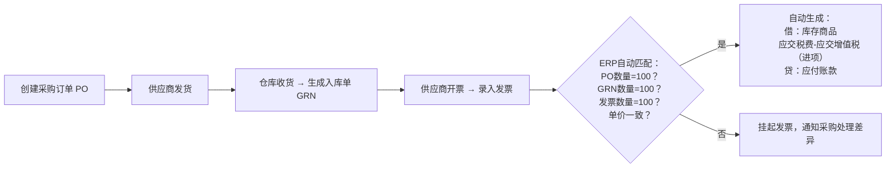

你问得非常关键！**“三单匹配”（Three-Way Matching）** 确实是企业采购到付款（Procure-to-Pay, P2P）流程中的核心控制点。它**既不是单纯为了方便做账，也不是会计准则的直接强制要求**，而是源于 **内部控制、风险防范、成本准确性和税务合规** 的综合需要。

下面我从**本质目的、驱动逻辑、实际价值**三个层面为你彻底讲清楚：

---

## 一、什么是三单匹配？（再确认一下）

以**采购场景**为例，三单指：
1. **采购订单（PO, Purchase Order）**  
   → 企业向供应商发出的“要货+价格+数量”承诺。
2. **入库单（GRN, Goods Receipt Note）**  
   → 仓库实际收到货物的记录（数量、质量验收）。
3. **采购发票（Invoice）**  
   → 供应商开来的付款请求（含单价、税额、总金额）。

✅ **三单匹配 = 系统自动校验这三张单据在“数量”和“单价”上是否一致**，只有匹配成功，才能安排付款。

---

## 二、为什么需要三单匹配？四大核心原因

### 1️⃣ **防止多付、错付、重复付款（资金安全）**
- **风险场景**：  
  - 供应商发票数量写100件，但实际只送了80件；  
  - 发票单价比合同高（比如PO写10元/件，发票开12元）；  
  - 同一张发票重复提交报销。

- **三单匹配的作用**：  
  系统自动拦截不一致的发票，财务**不能付款**，直到查明原因。  
  → **保护公司现金流不被侵占或浪费**。

> 💡 这是**内部控制（Internal Control）的基本要求**，属于COSO框架中的“授权与审批”“资产保护”原则。

---

### 2️⃣ **确保成本核算准确（管理会计 & 财务会计）**
- 如果按发票直接入账，而不管实际收货数量：  
  - 可能**高估库存**（账上有100件，实际只有80件）；  
  - 可能**低估成本**（如果少收货但按发票全额计入成本，未来销售时成本就不准）。

- 三单匹配后，系统才确认：  
  - **存货增加 = 实际入库数量 × 标准/发票单价**  
  - **应付账款 = 应付金额**

→ 保证资产负债表（存货）和利润表（成本）的真实可靠。

---

### 3️⃣ **满足税务合规要求（尤其是增值税抵扣）**
- 在中国等实行**增值税专用发票抵扣制度**的国家：  
  - 企业只有取得**真实、合法、与业务一致**的专票，才能抵扣进项税。
- 如果发票数量/金额与实际交易不符：  
  - 税务局可能认定为“虚开发票”，**不允许抵扣**，甚至处罚。

✅ 三单匹配形成的完整证据链（PO + 入库 + 发票），正是税务稽查时证明“业务真实性”的关键！

> 📌 虽然《企业会计准则》没有明文写“必须三单匹配”，但**《发票管理办法》《税收征管法》要求业务真实、凭证完整**——三单匹配是最有效的落地手段。

---

### 4️⃣ **提升运营效率与供应商协同**
- 自动匹配减少人工核对时间；
- 不一致时系统自动触发异常处理流程（如通知采购员联系供应商）；
- 长期可分析供应商交货准确性，优化供应链管理。

---

## 三、常见误区澄清

| 误区 | 正解 |
|------|------|
| “会计准则要求必须三单匹配” | ❌ 准则没规定具体操作，但要求“交易真实、计量可靠”——三单匹配是实现手段 |
| “小企业不用搞这么复杂” | ⚠️ 小企业虽可简化，但若涉及专票抵扣、成本核算，仍需基本匹配（至少“两单”：入库+发票） |
| “ERP自动匹配就行，不用管” | ❌ 如果PO乱下、入库不验货，系统也会“垃圾进，垃圾出” |

---

## 四、三单匹配在ERP中如何工作？（简例）

---

## ✅ 总结一句话：
> **三单匹配不是为了“做账方便”，而是企业通过流程控制，确保“钱花得值、账记得准、税抵得稳、风险控得住”的关键防线。**

它是**业财一体化在采购环节的典型体现**，也是现代企业内控成熟的标志之一。

---

如果你感兴趣，我可以：
- 对比“三单匹配” vs “两单匹配”（如服务类采购无入库单）；
- 举例说明“三单不匹配”如何导致财报重大错报；
- 或解释SAP中“GR/IR（货到票未到）”暂估科目如何运作。

欢迎继续提问！😊