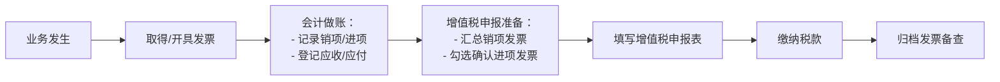

非常好！你提出的是一个**从零开始、层层递进、系统构建知识体系**的要求。下面我将按照你的逻辑，分 **四大模块** 逐步讲解：

> **模块1：发票是什么？——从一张纸说起**  
> **模块2：税是什么？——国家为什么要收税？企业为什么交税？**  
> **模块3：企业中的发票与税如何挂钩？——以增值税为核心**  
> **模块4：企业财务怎么做税务申报？——发票、账、税的闭环操作**

全程用**生活化语言 + 逻辑图 + 实务案例**，确保你真正“从0到1”建立完整认知。

---

## 📄 模块1：发票是什么？——不只是“收据”

### 1.1 发票的日常印象 vs 法律定义
- **普通人理解**：买东西开的“收据”，证明我付了钱。
- **法律定义（《发票管理办法》）**：  
  > “在购销商品、提供或接受服务等经营活动中，开具、收取的**收付款凭证**。”

但关键在于：  
> **在中国，发票是国家税务系统用来监控交易、征收税款的“法定工具”。**

### 1.2 发票的核心要素（缺一不可）
一张合规发票必须包含：
- 购买方名称、纳税人识别号（企业必须有！）
- 销售方名称、税号、开票日期
- 商品/服务名称、数量、单价、金额
- 税率、税额
- 发票专用章（电子发票自动带CA签章）

✅ **没有这些 = 不合规发票 = 税务不认！**

### 1.3 发票的类型（中国现行）
| 类型 | 谁能开？ | 能否抵扣增值税？ | 用途 |
|------|--------|----------------|------|
| **增值税专用发票** | 一般纳税人 | ✅ 可以（需认证） | 企业间大额交易 |
| **增值税普通发票** | 所有一般/小规模纳税人 | ❌ 不可抵扣 | 面向个人或不要抵扣的企业 |
| **数电票（全面数字化电子发票）** | 所有纳税人（逐步替代纸质） | ✅ 专票属性可抵扣 | 未来主流，全国统一平台 |

> 💡 小贴士：  
> - **个人消费者**通常拿普票（不需要抵扣）；  
> - **企业采购**必须索要**专票**（否则多交税！）。

---

## 💰 模块2：税是什么？——国家如何“分蛋糕”

### 2.1 税的本质
> **税 = 公民/企业向国家支付的“公共服务使用费”**  
> （如国防、教育、道路、治安）

企业交税，不是“被剥削”，而是**参与社会协作的成本**。

### 2.2 企业主要交哪些税？（聚焦核心）
| 税种 | 谁交？ | 对什么征？ | 特点 |
|------|------|----------|------|
| **增值税（VAT）** | 销售方（代收代缴） | 商品/服务的“增值部分” | **流转税，环环抵扣** |
| **企业所得税** | 企业自身 | 利润（收入−成本−费用） | **直接税，赚了才交** |
| **消费税** | 特定行业（烟酒、化妆品等） | 高利润/高耗能/奢侈品 | **在增值税基础上再征** |
| 附加税（城建税、教育费附加） | 交增值税/消费税的企业 | 实际缴纳的增值税/消费税 | 约12%附加 |

> ✅ **本篇重点讲增值税**——因为它和发票关系最直接、最频繁。

---

## 🔄 模块3：企业中的发票与税如何挂钩？——以增值税为例

### 3.1 增值税的核心思想：**只对“增值”部分征税**
> 避免重复征税！每个环节只交自己“加的那部分价值”的税。

#### 🌰 举个完整例子（简化版）：
假设一件衣服从棉花到消费者，经历三个环节：
当前环节的增值税 = 当前环节的含税金额 - 当前环节的不含税金额
当前环节的含税金额 = 当前环节的销售金额 = 上一环节的含税金额 + 当前环节的增值税金额

当前环节销售金额 = 采购金额 + 增值金额 + 

销售单价 （含税单价）= 销售不含单价  ➕ 销售增值税金额
销售增值税金额 = 增值额 ✖️ 增值税率
增值额 = 销售不含单价 ➖ 采购不含税单价

应纳增值税额 = 增值额 ✖️ 增值税率 
增值额 = 销售不含税单价 - 采购不含税单价
销项税额 = 销售不含税单价 ✖️ 增值税率
进项税额 = 采购不含税单价 ✖️ 增值税率
应纳增值税额 = 销项税额 ➖ 进项税额


销售单价 采购价 采购不含税单价


| 环节           | 业务      | 开具发票              | 增值额          | 应交增值税（税率13%）     |
| ------------ | ------- | ----------------- | ------------ | ---------------- |
| 1. 农民 → 纺纱厂  | 卖棉花100元 | 开普票（免税）           | 100          | 0（农产品免税）         |
| 2. 纺纱厂 → 服装厂 | 卖纱线213元 | 开**专票**：200元+13元税 | 100（213−100） | 13元（13销项 − 0进项）  |
| 3. 服装厂 → 商场  | 卖衣服326元 | 开**专票**：313元+13元税 | 100（326−2）   | 13元（26销项 − 13进项） |
| 4. 商场 → 消费者  | 卖衣服439元 | 开**普票**：426元+13元税 | 100（400−300） | 13元（52销项 − 39进项） |

✅ **关键发现**：
- 每个企业实际只交了**自己创造的100元增值 × 13% = 13元**；
- **发票是传递“已交税”信息的载体**；
- 最终52元增值税由**消费者承担**，企业只是“代收代缴”。

---

### 3.2 核心概念定义
| 术语 | 含义 | 举例 |
|------|------|------|
| **销项税** | 你销售时向客户收的增值税 | 卖100元产品（13%税率）→ 收113元，其中13元是销项税 |
| **进项税** | 你采购时支付的增值税（凭专票可抵扣） | 买原材料花113元（含13元税）→ 这13元是进项税 |
| **应纳增值税** | 实际要交给税务局的钱 | = 销项税 − 进项税 |

> 📌 **公式**：  
> **应纳增值税 = ∑销项税 − ∑进项税**  
> 如果结果为负 → 形成“留抵税额”，可结转下期抵扣（或申请退税）。

---

## 🧾 模块4：企业财务怎么做税务申报？——发票、账、税的闭环

### 4.1 财务操作全流程（月度）



---

### 4.2 关键操作详解

#### 步骤1：**发票管理**
- **开票**：销售后及时开具正确税率的发票（开票即产生纳税义务！）
- **收票**：采购后必须取得**合规专票**，并在**360天内**在【增值税综合服务平台】勾选确认

> ⚠️ 注意：  
> - 普票不能抵扣！  
> - 发票内容必须真实（不能写“办公用品”而不列明细）

#### 步骤2：**会计核算**
- 销售时：
  ```text
  借：应收账款 113  
  贷：主营业务收入 100  
      应交税费—应交增值税（销项税额）13
  ```
- 采购时（取得专票）：
  ```text
  借：原材料 100  
      应交税费—应交增值税（进项税额）13  
  贷：应付账款 113
  ```

#### 步骤3：**增值税申报（每月15日前）**
财务需填写《增值税纳税申报表》，核心数据来自：
- **销项税总额** = 本月所有销售发票的税额之和
- **进项税总额** = 本月勾选确认的专票税额之和

> 系统自动计算：  
> **应补（退）税额 = 销项 − 进项 − 上期留抵**

#### 步骤4：**缴税与归档**
- 通过电子税务局缴税；
- 将所有发票（存根联、抵扣联）扫描归档，保存**10年**。

---

### 4.3 企业所得税的发票要求（年度）
- 年底前，所有成本费用必须取得**合规发票**；
- 未取得发票的支出 → **纳税调增** → 多交25%企业所得税；
- 次年5月31日前取得发票 → 可“追补扣除”，但资金成本已损失。

---

## ✅ 终极总结：发票、税、财务的关系

| 角色 | 作用 | 关键要求 |
|------|------|--------|
| **发票** | 交易的“税务身份证” | 真实、合法、完整、及时 |
| **增值税** | 对“增值”征税，靠发票实现环环抵扣 | 销项−进项=实缴税额 |
| **企业财务** | 发票的“守门人”+税务的“执行者” | 管好发票 → 做准账 → 报好税 |

> **一句话闭环**：  
> **业务产生发票 → 发票决定税额 → 财务核对入账 → 系统申报缴税 → 税务局监管稽查。**

---

如果你希望，我可以：
- 提供一份《增值税月度申报操作清单》；
- 模拟一家小公司的完整月度税务处理（含分录、报表、申报表）；
- 或对比“一般纳税人”和“小规模纳税人”在发票与税上的差异。

欢迎继续深入！😊