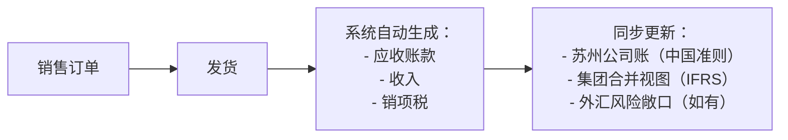

如何理解下面的话：当业务发生后，也产生了对应的财务原始凭证，但此时还未结束，会计科目表会分为三个管理层级：公司代码级别＜集团级别<国家级别。公司代码级别的科目表是为了管理对应企业的子分支机构财务数据，是为了满足公司代码间可能存在不同的财务要求的管理场
景；集团级别科目表是高于公司代码的一级，相当于是对集团下子公司等财务数据的合并，汇总为集团的财务报表；国家级别科目表是应国家的管理要求，外贸企业甚至应用到国外的会计制度，由下级的财务数据生成国家级别的财务报表。业务发生后，按照逻辑规则全流程一步自动记账，实现从业务产生>子公司财务>集团财务>国家财务报表产出，完整的体现了业务财务一体化的管理思想。

你引用的这段话，实际上描述的是**大型集团企业在多组织、多准则环境下的财务核算与报表合并机制**，核心体现了“**业务驱动财务、财务分层管理、数据自动流转**”的现代财务理念。下面我用通俗语言 + 结构化逻辑 + 实例，帮你逐层拆解并澄清其中的关键概念（包括一些表述上可优化的地方）。

---

## 一、先说结论：这段话想表达什么？

> **当一笔业务发生后，系统能自动根据预设规则，将原始凭证“智能映射”到不同管理层级的会计科目中，最终同时满足子公司经营核算、集团合并报表、国家监管披露三重需求——这就是“业财一体化”的高级形态。**

但要注意：原文中“公司代码级别 < 集团级别 < 国家级别”的层级关系和“国家级别科目表”的说法，在专业术语上**不够准确**，我们稍后会修正。

---

## 二、关键概念澄清（避免误解）

### ❌ 原文问题1：“会计科目表分为三个管理层级”
✅ 更准确的说法是：
> **企业可以设置多套“会计科目体系”或“报表维度”，用于不同目的，但底层业务数据是同一份。**

- **不是“科目表分级”**，而是**同一笔业务数据，按不同规则“翻译”成不同口径的报表**。
- 就像同一个人，对家人叫“儿子”，对公司叫“员工”，对政府叫“纳税人”——身份没变，称呼（口径）变了。

### ❌ 原文问题2：“国家级别科目表”
✅ 实际应理解为：
> **为满足不同国家/地区的法定报告要求（如中国会计准则、IFRS、US GAAP），系统可生成多套合规报表。**

- 并不存在一个叫“国家级科目表”的东西，而是**报表输出时按目标准则进行转换**。

---

## 三、三层管理视角详解（用制造业集团举例）

假设：**“中国智造集团”**
- 总部在上海（集团层面）
- 子公司A：苏州制造厂（内销为主）
- 子公司B：深圳外贸公司（出口欧美）
- 还在德国有一家控股子公司

### 🌐 场景：苏州工厂卖出一批货，收入100万元（含税）

#### 第一层：**公司代码级别（Legal Entity Level）**
- ✅ **目的**：满足**单个法人实体**的独立核算与税务申报。
- 🔧 **怎么做**：
  - 苏州公司按**中国《企业会计准则》** 做账：
    ```text
    借：银行存款 1,000,000  
    贷：主营业务收入 884,956  
        应交税费—应交增值税（销项）115,044
    ```
  - 科目使用“中国本地科目表”（如“1403 库存商品”、“6001 主营业务收入”）。
- 📌 **特点**：精细、合规、满足当地税务局要求。

#### 第二层：**集团级别（Consolidation Level）**
- ✅ **目的**：编制**整个集团的合并财务报表**，供董事会、投资者使用。
- 🔧 **怎么做**：
  - 系统自动将苏州、深圳、德国子公司的账，按**统一集团会计政策**（通常趋同IFRS）进行：
    - 消除内部交易（比如苏州卖给深圳的货）
    - 统一折旧方法、收入确认时点
    - 外币折算（德国欧元→人民币）
  - 输出：集团合并资产负债表、利润表等。
- 📌 **特点**：强调“可比性”和“整体价值”，不关注单个公司税务细节。

#### 第三层：**法定/监管级别（Statutory / Compliance Level）**
- ✅ **目的**：满足**不同国家监管机构**的披露要求。
- 🔧 **怎么做**：
  - 向中国财政部/税务局：报送按**中国会计准则**的报表；
  - 向欧盟投资者：提供按**IFRS**编制的英文财报；
  - 若在美国上市：还需按**US GAAP**调整并披露。
- 📌 **关键**：不是重新做账，而是在**同一套业务数据基础上，通过映射规则自动生成多套报表**。

> 💡 现代ERP系统（如SAP、Oracle）支持“**多会计准则并行**”（Parallel Accounting），一笔业务录入，系统自动按不同准则生成多套账。

---

## 四、什么是“业务财务一体化”？如何实现“自动记账”？

### 核心思想：
> **业务系统（如销售、采购、生产）与财务系统深度集成，业务动作触发财务记账，无需人工干预。**

### 自动记账流程示例：


✅ 实现条件：
- 业务系统与财务系统打通（如ERP）；
- 预设好“业务事件 → 会计科目 → 多准则映射”规则；
- 主数据（客户、物料、科目）标准化。

---

## 五、总结：三层管理的本质是什么？

| 层级 | 目标用户 | 核心要求 | 数据特点 |
|------|--------|--------|--------|
| **公司代码级** | 子公司管理者、税务局 | 合规、精细、本地化 | 法人独立账套 |
| **集团级** | CEO、CFO、股东 | 可比、透明、战略视角 | 合并、抵消、统一政策 |
| **法定/监管级** | 政府、交易所、国际投资者 | 符合特定会计准则 | 多准则、多语言、多格式 |

> 🔗 **三者关系不是“上下级科目表”，而是“同一数据源，多维输出”。**

---

## ✅ 最终理解：
> 所谓“从业务产生 → 子公司 → 集团 → 国家报表”的自动流转，  
> 本质是：**通过系统集成与规则预设，让一笔业务数据“一次录入、多处合规使用”，  
> 既满足微观经营核算，又支撑宏观决策与监管披露——这才是真正的“业财融合”。**

---

如果你感兴趣，我可以：
- 画一张“多准则并行核算”的数据流图（文字版）；
- 对比SAP中“公司代码”“控制范围”“合并组”的设置逻辑；
- 或举例说明“同一笔出口业务，如何同时满足中国税务和IFRS披露”。

欢迎继续提问！😊